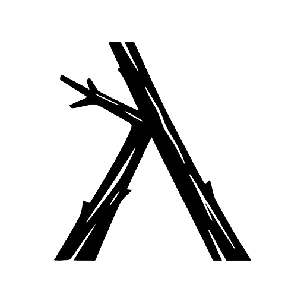

<p align="center">
  
</p>

# Kvist

Kvist - A Practical Lisp for Systems Programming

Kvist is a general-purpose Lisp-shaped language for writing fast, compact
programs. It combines expression-oriented syntax and macros with explicit
ownership and memory semantics that stay close to the machine.

Kvist compiles to readable Odin and uses Odin for checking, building, and
running programs. It draws from Lisp and Clojure in its source shape and
metaprogramming model, but it does not introduce a hidden runtime, seq layer, or
garbage-collected object model. The generated Odin remains the program.

Kvist code is structural enough to bend with macros, explicit enough to trust,
and close enough to the generated program that there is nowhere for surprises to
hide.

## Coming From Odin Or Clojure

For Odin developers, Kvist keeps the important semantics on the surface:
explicit imports, concrete structs, enums, unions, pointers, slices, dynamic
arrays, `defer`, `delete`, and ordinary mutation. The difference is source
shape: Kvist gives those pieces expression-oriented syntax, macros, and compact
data transformation forms while still producing readable Odin.

For Clojure developers, Kvist borrows the shape, not the runtime. It is eager,
mutable, and ownership-oriented. Values are not persistent by default,
collection helpers allocate ordinary owned buffers, and mutation is a normal
part of the language. The `kvist:arr` package provides many familiar collection
operations in both fresh-result and mutating bang forms. Functional patterns are
available where they fit the execution model, and procedure arguments are
immutable by default.

## What It Looks Like

This is all it takes to write hello world:

```clojure
(defn main []
  (println "hello from kvist"))
```

Here is a slightly larger example with a struct, a typed function, a loop, and
owned data cleaned up with `:defer`:

```clojure
(defstruct Order {
  customer: string
  amount: int
  paid?: bool
})

(defn paid-total [orders: []Order] -> int
  (let [total 0]
    (for [order orders]
      (when order.paid?
        (mut! total += order.amount)))
    total))

(defn main []
  (let [orders [(Order {customer: "Ada" amount: 120 paid?: true})
                (Order {customer: "Lin" amount: 80 paid?: false})] :defer]
    (println (paid-total orders))))
```

## Reading Kvist Syntax

Kvist uses Lisp-style forms: the first item says what is happening, and the rest
are arguments. Types are written after names with `:`.

```clojure
(defn paid-total [orders: []Order] -> int  ;; name, typed args, return type
  (transduce paid-amounts + 0 orders))
;; The final expression is the return value.
```

Read that as: define a procedure named `paid-total`; it takes one parameter,
`orders`, typed as `[]Order`; it returns `int`; the body is one expression. If a
non-void function body ends with an expression, that final expression is the
return value.

Parameters live in a vector because they are structured data, not a comma list:

```clojure
(defn move! [x: ^f32 y: ^f32 dx: f32 dy: f32]  ;; pointer params
  (mut! x^ += dx)  ;; x^ dereferences
  (mut! y^ += dy))
```

Pointer syntax is compact: `^T` is a pointer type, `value^` dereferences, and
`&value` takes an address. Kvist also provides explicit Lisp forms for the same
operations when that reads better in a macro or nested form: `(ptr T)`,
`(deref value)`, and `(addr value)`.

Return specs can be a single type, multiple positional values, or named return
values:

```clojure
(defn parse-count [text: string] -> [value: int, ok: bool]  ;; named returns
  ...)

(defn bounds [xs: []int] -> [int int]  ;; positional returns
  ...)
```

Multiple return values bind positionally:

```clojure
(let [[value ok] (parse-count "42")]  ;; destructures return values
  (when ok
    (println value)))
```

## Small Core, Real Libraries

Kvist keeps the core language small. Most programs are built from a short set of
declarations and control forms, plus explicit package imports:

- declarations: `package`, `import`, `def`, `defvar`, `defstruct`, `defenum`,
  `defunion`, `defn`, `defmacro`, `deftransform`, `defsource`
- local structure: `let`, `do`, `block`, `fn`
- control flow: `if`, `when`, `cond`, `case`, `while`, `for`, `break`,
  `continue`, `return`, `defer`
- mutation and places: `set!`, `mut!`, `update!`, `inc!`, `dec!`, `toggle!`,
  `delete!`, `get`, `slice`, `addr`, `deref`
- construction and interop: type-call syntax, `make`, `type`, `foreign-import`,
  `odin`, `attr`, `export`, `exports`

More functionality lives in ordinary libraries. Shipped Kvist packages provide
array, map, set, string, HTML, test, CLI, source, and struct-of-arrays helpers.
Odin's `core:*`, `base:*`, and `vendor:*` packages can be imported directly, so
Kvist code can use Odin's standard library and vendored packages without wrapper
APIs.

`.kvist` and `.odin` files can also live side by side in one package. Kvist
compiles its source into generated Odin and builds the package with sibling Odin
files included, so direct Odin code stays available for low-level boundaries,
bindings, and cases where the target language is the clearest tool. See the
[language reference](LANGUAGE.md) for the full file model.

## Why It Exists

Kvist is for programs that want systems-level control without giving up the
leverage of a small, regular language:

- write data-oriented code with less ceremony
- keep ownership, allocation, and deletion visible
- use macros for declarations, DSLs, generated glue, and editor-friendly source
  transformations
- inspect the generated code when performance, debugging, or interop matters
- use `check`, `run`, `eval`, and reload tooling without a separate interpreter

The result is a small systems language with a friendly source shape and an
inspectable output. Less ceremony, same floorboards.

## Quickstart

Install the [Odin compiler](https://odin-lang.org/docs/install/), then build
the Kvist CLI:

```sh
odin build cmd/kvist -out:kvist
```

Create `hello.kvist`:

```clojure
(defn main []
  (println "hello from kvist"))
```

Run it:

```sh
./kvist run hello.kvist
```

Check or build it without running:

```sh
./kvist check hello.kvist
./kvist build hello.kvist
```

Inspect the Odin that Kvist generated:

```sh
./kvist run hello.kvist --generated hello.odin
```

## Whirlwind Tour

This is the quick spin, not the full manual.

### Data, Loops, And Mutation

Kvist has concrete structs, enums, unions, pointers, slices, dynamic arrays,
loops, mutation, and typed literals:

```clojure
(defenum Status [
  Pending
  Running
  Done
])

(defstruct Counter {
  name: string
  value: int
  status: Status
})

(defunion Event {
  tick: int
  message: string
})

(defn tick! [counter: ^Counter amount: int]
  (mut! counter.value += amount))

(defn print-values [values: []int]
  (for [value i values]
    (println i value)))
```

`set!` is plain assignment. Prefer the mutation helpers when the operation is
more specific: `mut!` for compound assignment, `inc!` and `dec!` for counters,
and `toggle!` for booleans.

```clojure
(set! counter.status .Running)  ;; plain assignment
(mut! counter.value += amount)  ;; compound assignment
(inc! frame)                    ;; counter helper
(toggle! enabled?)              ;; boolean helper
```

Typed literals make the resulting shape explicit:

```clojure
([]int [1 2 3])                            ;; slice literal
(map[string]int {"ok" 200 "missing" 404})  ;; map literal
(Counter {name: "frames" value: 0 status: .Pending})
;; ^ struct literal
```

Kvist uses type-call syntax for construction and conversion: `(T value)` means
"construct or convert this value as `T`." There is no separate `new` form for
ordinary values, and struct construction is just the struct type applied to a
brace literal. Use `make` for runtime allocation, such as creating an empty
dynamic array with capacity.

```clojure
(i32 count)                ;; conversion
(Counter {...})            ;; construction
(make [dynamic]int 0 128) ;; runtime allocation
```

### Control Flow Stays Familiar

Use `if`, `when`, `case`, `while`, and `for` as expression-oriented forms:

```clojure
(defn describe [status: Status] -> string
  (case status
    .Pending "waiting"
    .Running "moving"
    .Done "finished"
    :else "unknown"))

(defn countdown [n: int]
  (let [i n]
    (while (> i 0)
      (println i)
      (dec! i))))
```

### Ownership Is Part Of The Code

Owned dynamic arrays and maps are ordinary values. When a local owns memory, say
what should happen to it:

```clojure
(import arr "kvist:arr")

(defn print-range []
  (let [xs (arr.range 0 8)]
    ;; Explicit cleanup.
    (defer (delete xs))
    (for [x xs]
      (println x))))
```

For the common local-binding case, `:defer` is just the tidy spelling:

```clojure
(import arr "kvist:arr")

(defn print-squares []
  ;; :defer is let-binding sugar for defer/delete.
  (let [xs (arr.range 0 8) :defer
        squares (arr.map (fn [x: int] -> int (* x x)) xs) :defer]
    (for [square squares]
      (println square))))
```

Use `:defer`, return the owned value, or pass it to an API that takes ownership.
There is no hidden collector cleaning up behind the scenes. See
[Ownership](docs/OWNERSHIP.md) for the full rules.

### Results Can Be Direct Too

Multiple return values bind positionally, and guard markers keep the "try this
or leave" pattern compact:

```clojure
(import strconv "core:strconv")

(defn parse-or-zero [text: string] -> int
  ;; Many APIs return value, ok.
  (let [[value ok] (strconv.parse-int text)]
    (if ok value 0)))

(defn parse-required [text: string] -> [value: int, ok: bool]
  ;; :or-return returns named result values when ok is false.
  (let [[value ok] (strconv.parse-int text) :or-return]
    (return value true)))
```

For the common `value, ok` shape, `when-let` and `if-let` bind and branch in one
form:

```clojure
(when-let [value ok (strconv.parse-int "42")]
  (println value))
```

For `value, err` APIs, use `when-ok` and `if-ok`. The success branch is still
ordinary Kvist, so owned results stay visible:

```clojure
(import os "core:os")

(defn byte-count [path: string] -> int
  (if-ok [data err (os.read_entire_file path context.allocator)]
    (do
      (defer (delete data))  ;; owned bytes from the allocator
      (len data))
    0))
```

### Fused Collection Pipelines

Kvist supports Clojure-style transformation pipelines without requiring a seq
runtime. `deftransform`, `into`, and `transduce` lower to fused loops. See
[Functional Transforms](docs/FUNCTIONAL-TRANSFORMS.md) for the details:

```clojure
(deftransform active-names
  ;; Compile-time transform structure, not a runtime seq.
  (comp
    (filter .active?)
    (map .name)))

(defn names [users: []User] -> [dynamic]string
  ;; into allocates a fresh owned dynamic array.
  (into [dynamic]string active-names users))

(defn active-count [users: []User] -> int
  ;; transduce lowers to one fused loop.
  (transduce active-names
             (fn [count: int _name: string] -> int (+ count 1))
             0
             users))
```

When you already have a collection to mutate, use package bang helpers such as
`arr.into!`, `arr.sort-by!`, and `map.put!`.

### Macros And DSLs

Kvist macros rewrite Kvist source before normal lowering. They are useful for
removing boilerplate while keeping the generated code visible. See
[Macros](docs/MACROS.md) for the full macro model:

```clojure
(defmacro unless [condition & body]
  (quasiquote
    (if (unquote condition)
      (do)
      (do (splice body)))))
```

The shipped HTML package uses that macro surface for a compact Hiccup-style DSL
that stays close to real HTML:

```clojure
(import html "kvist:html")

(html.render
  [div {class "toolbar"}
   [button {type "button" data-action "save"} "Save"]
   [button {type "button" data-action "cancel"} "Cancel"]])
```

### Escape Hatches

Kvist has ordinary package imports for both Kvist source packages and target
packages. Raw Odin is available deliberately at the boundary. See the
[language reference](LANGUAGE.md) for the complete form list:

```clojure
(import fmt "core:fmt")

(odin "foreign import libc \"system:c\"")
```

## Tooling

The CLI is built around the normal edit/check/run loop:

```sh
./kvist check examples/language/hello.kvist
./kvist run examples/language/hello.kvist
./kvist test examples/coverage/packages/test-package-tests.kvist
```

It also supports source-aware evaluation and expansion:

```sh
./kvist eval examples/collections/higher-order.kvist '(threaded-total)'
./kvist expand examples/collections/higher-order.kvist '(threaded-total)'
./kvist macroexpand examples/language/data-literals.kvist \
  '(with-allocator [allocator context.temp_allocator] (temp-buffer-len))'
```

There is also editor-oriented symbol lookup, completion, xref, and document
lookup support in the CLI, plus native reload tooling for programs that opt into
that workflow.

## Packages

Kvist ships small source packages that are meant to read like ordinary Kvist,
not like a separate standard-library runtime:

- `kvist:arr` for dynamic array helpers
- `kvist:map` and `kvist:set` for owned collection helpers
- `kvist:str` for string helpers
- `kvist:html` for Hiccup-style HTML generation
- `kvist:http` for small HTTP examples
- `kvist:soa` for struct-of-arrays helpers
- `kvist:test` for package-level tests

`kvist:arr` is intentionally substantial. It provides many of the everyday
collection operations Clojure programmers reach for, but with explicit
ownership: helpers such as `arr.map`, `arr.filter`, and `arr.sort-by` return
fresh owned dynamic arrays, while bang helpers such as `arr.map!`,
`arr.filter!`, `arr.sort-by!`, and `arr.into!` mutate existing storage.

```clojure
(import arr "kvist:arr")

(defn paid-users [users: []User] -> [dynamic]User
  (arr.filter .paid? users))

(defn sort-users! [users: [dynamic]User]
  (arr.sort-by! .name users))
```

Target packages are just imports too. A tiny Raylib window starts like this:

```clojure
(import rl "vendor:raylib")

(defn main []
  (rl.InitWindow 800 450 "Kvist + Raylib")
  (defer (rl.CloseWindow))
  (while (not (rl.WindowShouldClose))
    (rl.BeginDrawing)
    (rl.ClearBackground rl.RAYWHITE)
    (rl.DrawText "hello from kvist" 280 210 24 rl.DARKGRAY)
    (rl.EndDrawing)))
```

## Repository Map

- `src/kvist/` - compiler implementation
- `cmd/kvist/` - CLI
- `packages/` - shipped Kvist source packages
- `examples/` - runnable examples and package coverage
- `tests/` - compiler tests
- `docs/` - focused notes for deeper topics
- `emacs/` - editor integration

## Documentation

- [LANGUAGE.md](LANGUAGE.md) - language reference
- [docs/OWNERSHIP.md](docs/OWNERSHIP.md) - ownership and deletion rules
- [docs/MACROS.md](docs/MACROS.md) - macro authoring
- [docs/SEQUENCES.md](docs/SEQUENCES.md) - collection helpers
- [docs/FUNCTIONAL-TRANSFORMS.md](docs/FUNCTIONAL-TRANSFORMS.md) - `deftransform`, `into`, `transduce`
- [docs/POINTERS.md](docs/POINTERS.md) - pointer syntax
- [docs/TOOLING.md](docs/TOOLING.md) - CLI/editor tooling
- [docs/HOT-RELOAD.md](docs/HOT-RELOAD.md) - native reload workflow
- [examples/README.md](examples/README.md) - example guide

## Alpha Status

Kvist is alpha software: syntax and package APIs are still moving, but the
compiler, source packages, examples, tests, editor commands, and reload workflow
are active. The bar for new language forms is simple: the generated Odin should
be readable and lower as expected. When syntax changes, the repository is kept
canonical rather than carrying old compatibility spellings.
