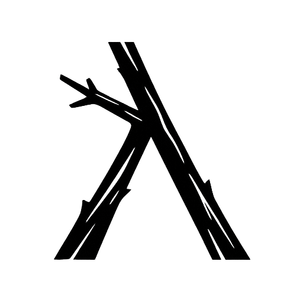

<div align="center">
  
</div>

# Kvist

A practical Lisp for native software that compiles to Odin.

[Website](https://kvist-lang.org/) · [Documentation](https://kvist-lang.org/docs/)

Kvist combines Clojure-inspired syntax, source macros, data-oriented
programming, and interactive development with Odin's native, statically typed
execution model. It explores what a Lisp can look like when concrete
representation, predictable costs, direct interoperability, and explicit
memory are foundational properties.

Different programs can lean on different parts of that combination. Kvist can
be used as a Lisp-shaped way to write ordinary native software, as a platform
for macros and DSLs, as an interactive environment for native code, or for
applications that mix concrete types with flexible data-oriented subsystems.

Ordinary values have Odin-like representation and ownership. Values are
statically typed, allocation and mutation remain explicit, and generated
programs require no VM or garbage collector. Kvist lowers to readable Odin,
imports Odin packages directly, and allows Kvist and Odin source files to
coexist in the same package.

When data-oriented programming is a better fit, `Data` provides EDN in memory:
immutable maps, vectors, sets, lists, keywords, symbols, and tagged values.
This makes Hiccup, transactions, Datalog queries, messages, configuration, and
other data DSLs feel like Lisp without making every runtime value dynamic.

## Highlights

- **Native REPL** — work with statically checked Kvist in a persistent project
  session where definitions, values, imports, macros, and recent results remain
  available.
- **Native by default** — concrete structs, arrays, maps, pointers, procedures,
  allocators, and explicit ownership.
- **Data-oriented programming** — immutable EDN-shaped values with
  destructuring, structural matching, persistent updates, typed validation,
  and decoding.
- **Fused transforms and iterators** — expressive collection pipelines lower
  to direct loops without lazy sequences or intermediate collections.
- **Source macros** — Lisp forms are transformed at compile time without adding
  a dynamic runtime object model.
- **Direct Odin interoperability** — use Odin packages and types without a
  wrapper ecosystem, including core and maintained vendor packages.

## Native Code And Data As Data

Ordinary Kvist values stay concrete and statically typed. This transform over
native structs lowers to one direct loop:

```clojure
(defstruct User [
  name: string
  active?: bool
])

(defn active-names [users: []User] -> [dynamic]string
  (into [dynamic]string
    (comp
      (filter .active?)
      (map .name))
    users))
```

When the shape itself is data, the same language can express Lisp-shaped DSLs
as immutable values:

```clojure
(defn page [title: string] -> Data
  [:main {:class "page"}
   [:h1 title]
   [:p "Ready"]])

(def names-query
  '[:find ?name
    :where [?e :contact/name ?name]])
```

The official [HTML package](https://github.com/kvist-lang/html) renders the
first value as Hiccup-shaped HTML. [VevDB](https://github.com/vevdb/vev) uses
the same `Data` model for Datomic-style transactions, Datalog queries, rules,
pull patterns, and query results.

## Quickstart

Install the [Odin compiler](https://odin-lang.org/docs/install/), clone this
repository, and build the Kvist CLI from the repo root:

```sh
git clone https://github.com/kvist-lang/kvist.git
cd kvist
odin build src/cli/kvist -o:speed
```

This builds an optimized compiler for normal use. When developing Kvist
itself, omit `-o:speed` for shorter rebuilds.

Add a main function to a `hello.kvist` file:

```clojure
(defn main []
  (println "hello from kvist"))
```

Run it:

```sh
$ ./kvist run hello.kvist
hello from kvist
```

Or use the same file as context for the REPL:

```text
$ ./kvist repl hello.kvist
Kvist native REPL
kvist=> (+ 1 1)
2
kvist=> (defn square [x: int] -> int (* x x))
kvist=> (square 11)
121
```

To install the compiler and shipped packages under a separate root:

```sh
./scripts/install.sh ~/.local/lib/kvist
export PATH="$HOME/.local/lib/kvist/bin:$PATH"
```

## Interactive Development

A REPL submission is ordinary Kvist, with the same static types, ownership,
and Odin interoperability as compiled programs. Definitions and supported
typed values persist, and compatible redefinitions update later calls without
replaying earlier forms.

The terminal client and editor-neutral JSONL protocol use the same native
session. The Emacs client adds source-buffer evaluation, completion,
documentation, retained value inspection, source-level stepping, execution
traces, conditions and restarts, and attachment to running applications.

See the [native REPL guide](docs/REPL.md) and
[Emacs guide](emacs/README.md). For Calva and CIDER, see the
[nREPL editor guide](docs/NREPL.md).

## Odin Interoperability

Kvist imports Odin packages directly:

```clojure
(import os "core:os")
(import sha2 "core:crypto/sha2")
(import raylib "vendor:raylib")
```

Procedures, types, constants, enums, multiple return values, allocators, and
errors retain their Odin semantics. Kvist and Odin source may also live in the
same package and call each other without a wrapper layer.

The same boundary is available interactively: persistent Kvist definitions can
contain Odin bodies, or a small Kvist development file can import a much larger
Odin package. See the [REPL/Odin example](examples/interop/repl-odin.kvist).

See the [Odin interoperability guide](docs/odin.md) and
[interop examples](examples/interop/).

## More Language Features

- Clojure-style threading, nested destructuring, and structural `Data`
  matching.
- Typed `Data` validation and decoding into native structs, enums, and arrays,
  with precise error paths.
- Explicit conditions and compiled restarts for programmatic or interactive
  recovery.
- Parametric polymorphism, overload sets, multiple return values, pointers,
  custom allocators, and struct-of-arrays storage.
- Inferred ownership boundaries, source-mapped diagnostics, compilation caches,
  and lifetime inspection.
- Shipped packages for native collections, EDN, regular expressions, parallel
  work, testing, bit operations, strings, and immutable `Data`.

## Tooling

```sh
./kvist check examples/language/hello.kvist
./kvist run examples/language/hello.kvist
./kvist repl examples/language/hello.kvist
./kvist test examples/coverage/packages/test-package-tests.kvist
./kvist eval examples/collections/higher-order.kvist '(threaded-total)'
./kvist expand examples/collections/higher-order.kvist '(threaded-total)'
./kvist lifetimes examples/collections/ownership-warnings.kvist
```

Run `./scripts/smoke.sh` for a quick local check.

## Platform Support

Kvist is tested on macOS and Linux. The core CLI and representative programs
are also tested on Windows, but the complete test suite and shell-based tooling
are not yet covered there.

Building Kvist requires an Odin toolchain supported by the host platform. The
scripts in `scripts/` require a POSIX-compatible shell.

## Documentation

- [Language reference](docs/language.md)
- [Native REPL and live development](docs/REPL.md)
- [nREPL editor integration](docs/NREPL.md)
- [Data](docs/data.md)
- [Data-oriented programming](docs/DATA-ORIENTED-PROGRAMMING.md)
- [Sequences](docs/sequences.md)
- [Transforms and iterators](docs/transforms.md)
- [Macros](docs/macros.md)
- [Conditions and restarts](docs/CONDITIONS.md)
- [Packages](docs/packages.md)
- [Odin interoperability](docs/odin.md)
- [Parallel helpers](docs/parallel.md)
- [Testing](docs/testing.md)
- [Tooling](docs/tooling.md)
- [Emacs](emacs/README.md)
- [Examples](examples/README.md)

## License

Kvist is licensed under the MIT License. See [LICENSE](LICENSE).

Programs written in Kvist, and Odin code generated from user-authored Kvist
source, are not required to use the MIT License merely because they were
compiled with Kvist. Code copied from Kvist packages or runtime support remains
under its applicable license.
